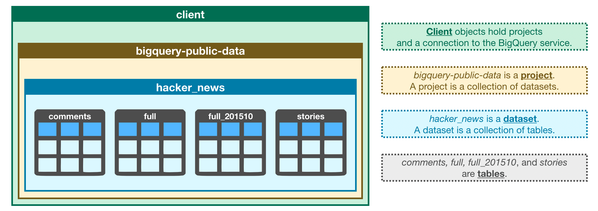

## SQL Tekrarı 

* SQL Genel tekrar yapıldı.
* BigQuery ile data çekmesi öğrenildi.
* BigQuery kullanarak query yazıp bunu limitlemeyi vs. öğrenildi
* Gün 3 te yapılması istenenler yapıldı

#### Yapılması gerekenler

* Gün 4 ve Gün 5'i yap 
* JOIN syntaxı nasıl kullanılır ona bak; left join,right join,outer join farklarına bak. Farklı join syntaxlarınada bak
* Where Having farkına bak
* Subquery tekrar et 
* World schemasında query yaz

##### Subquery bakmak dışında hepsi yapıldı.

> Bu 3 tekrarı eski sql dersindeki lab pdf'lerine bakarak yap onları baştan çöz
> Bunuda world schema'sını kullanarak yap

!!!X Bu tablo Bigquery'deki oluşturulan client ve alt tabakaların yapısını gösteriyor
